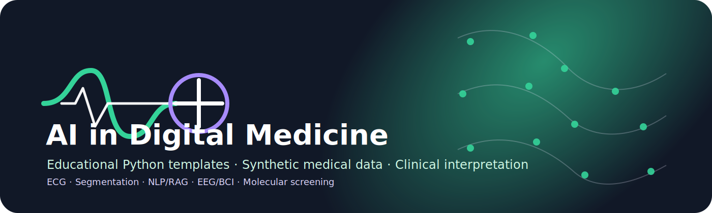

<div align="center">



# AI in Digital Medicine

### Educational repository for artificial intelligence and machine learning in modern digital medicine

[](https://www.python.org/)
[](https://jupyter.org/)
[](#important-notice)
[](#learning-modules)

</div>

---

## Overview

**AI in Digital Medicine** is an educational repository accompanying a textbook on artificial intelligence and machine learning in contemporary medicine. It contains compact Python templates and demonstration datasets for practical work with biomedical signals, medical-image segmentation metrics, clinical text retrieval, neurophysiological data, and molecular screening.

The repository is designed for medical students, residents, clinicians, and educators who want to understand not only how code runs, but also what the result means clinically.

---

## Important notice

> This repository is intended **only for educational use**.  
> The code and datasets are demonstration materials and must not be used for diagnosis, treatment, prognosis, triage, medical decision-making, or validation of clinical AI systems.

All datasets included here are synthetic or demonstrational. If real clinical data are used in teaching, they must be properly anonymized and handled according to institutional, ethical, and legal requirements.

---

## Learning modules

| Module | Topic | Code template | Main skill |
|---|---|---|---|
| 01 | ECG signal visualization | `code/01_ecg_visualization.py` | Reading and plotting biomedical signals |
| 02 | ECG classification | `code/02_ecg_classification.py` | Interpreting confusion matrix, sensitivity, specificity, F1-score, ROC-AUC |
| 03 | Medical-image segmentation | `code/03_dice_segmentation.py` | Calculating Dice coefficient and IoU |
| 04 | Clinical NLP / RAG | `code/04_mini_rag.py` | Retrieval-based grounding of language-model answers |
| 05 | EEG / BCI signals | `code/05_eeg_visualization.py` | Visual analysis of neurophysiological data and artifacts |
| 06 | Molecular screening | `code/06_molecular_screening.py` | Simple candidate ranking using ADMET-like criteria |

---

## Repository structure

```text
AI-in-Digital-Medicine/
├── assets/
│   └── banner.svg
├── code/
├── data/
│   ├── ecg/
│   ├── eeg/
│   ├── segmentation/
│   ├── nlp/
│   └── molecules/
├── docs/
├── notebooks/
├── requirements.txt
└── README.md
```

---

## Quick start

```bash
git clone https://github.com/MyProfile-projects/AI-in-Digital-Medicine.git
cd AI-in-Digital-Medicine
python -m venv .venv
source .venv/bin/activate      # macOS / Linux
# .venv\Scripts\activate     # Windows
pip install -r requirements.txt
python code/01_ecg_visualization.py
```

---

## Recommended teaching workflow

1. Start with the clinical question.
2. Open the corresponding dataset and discuss its structure.
3. Run the code template.
4. Interpret the output together with students.
5. Discuss limitations, possible sources of error, and clinical safety.
6. Ask the students to write a brief conclusion using medical terminology.

The goal is not programming from scratch, but understanding the connection between **data → algorithm → metric → clinical interpretation → limitation**.

---

## Minimal software requirements

- Python 3.10 or higher
- Jupyter Notebook or Google Colab, optional
- `numpy`
- `pandas`
- `matplotlib`
- `scikit-learn`

Additional packages such as `wfdb`, `pydicom`, `SimpleITK`, `PyTorch`, `FAISS`, or `Chroma` may be used in advanced classes, but they are not required for the basic version of this repository.

---

## For students

When completing an assignment, describe:

- what data were used;
- what the code calculated or visualized;
- what the output means;
- what limitations the method has;
- why the result cannot be treated as a clinical conclusion.

---

## For instructors

Before class, it is recommended to:

- check that all scripts run from the repository root;
- verify that file paths to `data/` are correct;
- prepare Jupyter or Google Colab versions if needed;
- explain that synthetic data are used for training purposes;
- evaluate both technical execution and clinical interpretation.

Suggested assessment structure:

| Criterion | Weight |
|---|---:|
| Code execution | 20% |
| Understanding of data structure | 20% |
| Interpretation of metrics or plots | 25% |
| Clinical meaning of the conclusion | 25% |
| Clarity and accuracy of the report | 10% |

---

<div align="center">

**Digital medicine requires not only intelligent algorithms, but also clinically responsible interpretation.**

</div>
